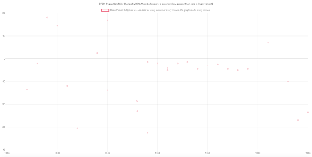

# STEDI Ecosystem

You work for the data science team at STEDI, a small startup focused on assessing balance for seniors. STEDI has an application that collects data from seniors during a small exercise. The user logs in, and then selects the customer they are working with. Then the user starts a timer, and clicks a button with each step the senior takes. When the senior has reached 30 steps, their test is finished. The data transmitted enables the application to monitor seniors’ balance risk. 

- Start the STEDI Application

- Log in to the STEDI application

- Click Create New Customer, create a test customer and submit

- Click start, then add steps until you reach 30 and the timer has stopped

- Repeat this three times, and you will receive a risk score


# Analyzing the Data

The STEDI data science team has configured some real-time data sources using Kafka Connect. One of those data sources is Redis. When a customer is first assessed in the STEDI application, their record  is added to a sorted set called Customer in redis. Redis is running on the default redis port (6379), and at localhost. The redis password is “notreally” (without quotes). Redis is configured as a Kafka source, and whenever any data is saved to Redis (including Customer information), a payload is published to the Kafka topic called redis-server. 

- To connect to the redis instance, from the terminal connect to Redis: 

```bash
/data/redis/redis-stable/src/redis-cli -a notreally
```

- Type:

```bash
zrange Customer 0 -1
```

- Locate the the customer you created in the output

- In another terminal run this command to start monitoring the kafka topic:

```bash
kafka-console-consumer --bootstrap-server localhost:9092 --topic redis-server
```

- Back in the redis-cli, type: 

```bash
zadd Customer 0 "{\"customerName\":\"Sam Test\",\"email\":\"sam.test@test.com\",\"phone\":\"8015551212\",\"birthDay\":\"2001-01-03\"}"
```

In the kafka consumer terminal you will see the following payload appear in the redis-server topic:

```json
{"key":"Q3VzdG9tZXI=","existType":"NONE","ch":false,"incr":false,"zSetEntries":[{"element":"eyJjdXN0b21lck5hbWUiOiJTYW0gVGVzdCIsImVtYWlsIjoic2FtLnRlc3RAdGVzdC5jb20iLCJwaG9uZSI6IjgwMTU1NTEyMTIiLCJiaXJ0aERheSI6IjIwMDEtMDEtMDMifQ==","score":0.0}],"zsetEntries":[{"element":"eyJjdXN0b21lck5hbWUiOiJTYW0gVGVzdCIsImVtYWlsIjoic2FtLnRlc3RAdGVzdC5jb20iLCJwaG9uZSI6IjgwMTU1NTEyMTIiLCJiaXJ0aERheSI6IjIwMDEtMDEtMDMifQ==","score":0.0}]}
```

Formatted version of the payload:
```json
{"key":"__Q3VzdG9tZXI=__",
"existType":"NONE",
"Ch":false,
"Incr":false,
"zSetEntries":[{
"element":"__eyJjdXN0b21lck5hbWUiOiJTYW0gVGVzdCIsImVtYWlsIjoic2FtLnRlc3RAdGVzdC5jb20iLCJwaG9uZSI6IjgwMTU1NTEyMTIiLCJiaXJ0aERheSI6IjIwMDEtMDEtMDMifQ==__",
"Score":0.0
}],
"zsetEntries":[{
"element":"eyJjdXN0b21lck5hbWUiOiJTYW0gVGVzdCIsImVtYWlsIjoic2FtLnRlc3RAdGVzdC5jb20iLCJwaG9uZSI6IjgwMTU1NTEyMTIiLCJiaXJ0aERheSI6IjIwMDEtMDEtMDMifQ==",
"score":0.0
}]
}
```

Both the key and the zSetEntries fields contain data that is base64 encoded. If you base64 decoded the above encoded data it would look like this:

```json
{"key":"__Customer__",
"existType":"NONE",
"Ch":false,
"Incr":false,
"zSetEntries":[{
"element":"__{"customerName":"Sam Test","email":"sam.test@test.com","phone":"8015551212","birthDay":"2001-01-03"}",
"Score":0.0
}__],
"zsetEntries":[{
"element":"{"customerName":"Sam Test","email":"sam.test@test.com","phone":"8015551212","birthDay":"2001-01-03"}",
"score":0.0
}]
}
```


# The Challenge

The application development team has programmed certain business events to be published automatically to Kafka. Whenever a customer takes an assessment, their risk score is generated, as long as they have four or more completed assessments. The risk score is transmitted to a Kafka topic called `stedi-events`. The `stedi-events` Kafka topic has a String key and a String value as a JSON object with this format:

```json
{"customer":"Jason.Mitra@test.com",
"score":7.0,
"riskDate":"2020-09-14T07:54:06.417Z"
}
```

The application development team was not able to complete the feature as the graph is currently not receiving any data. Because the graph is currently not receiving any data, you need to generate a new payload in a Kafka topic and make it available to the STEDI application to consume:


- Spark is installed in /data/spark

- Start the Spark Master, taking note of the log location of the master

- Read the master logs to determine the Spark master URI

- Start the Spark Worker

- Save the Spark startup logs for submission with your solution using the button below:


- Create a new Kafka topic to transmit the complete risk score with birth date to the STEDI application graph

- Edit `/home/workspace/stedi-application/application.conf` and set the the name of the newly created topic:

```
kafka {
  riskTopic=_________          
}
```

- Stop the STEDI application


- Start the STEDI Application

- Log in to the STEDI application

- From the timer page, use the toggle button in the upper right corner to activate simulated user data to see real-time customer and risk score data. Toggle off and on to create additional customers for redis events. Each time you activate it, STEDI creates 30 new customers, and then starts generating risk scores for each one. It takes 4 minutes for each customer to have risk scores generated, however customer data is generated immediately. To monitor the progress of data generated, from a terminal type: `tail -f /home/workspace/stedi-application/stedi.log`


- You are going to to write 3 Spark Python scripts:
    - `redis-server` Topic: Write one spark script `sparkpyrediskafkastreamtoconsole.py` to subscribe to the `redis-server` topic, base64 decode the payload, and deserialize the JSON to individual fields, then print the fields to the console. The data should include the birth date and email address. You will need these.
    - `stedi-events` Topic: Write a second spark script `sparkpyeventskafkastreamtoconsole.py` to subscribe to the `stedi-events` topic and deserialize the JSON (it is not base64 encoded) to individual fields. You will need the email address and the risk score.
    - New Topic: Write a spark script `sparkpykafkajoin.py` to join the customer dataframe and the customer risk dataframes, joining on the email address. Create a JSON output to the newly created kafka topic you created for STEDI to subscribe to that contains at least the fields below:

```json
{"customer":"Santosh.Fibonnaci@test.com",
 "score":"28.5",
 "email":"Santosh.Fibonnaci@test.com",
 "birthYear":"1963"
} 
```

- From a new terminal type: `/home/workspace/submit-event-kafkajoin.sh` to submit to the cluster

- Once the data is populated in the configured kafka topic, the graph should have real-time data points



- Upload at least two screenshots of the working graph to the screenshots workspace folder 

